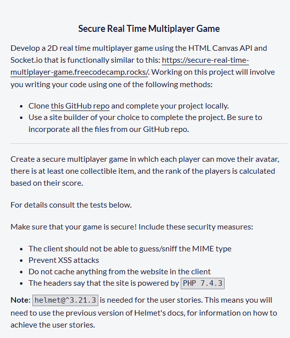
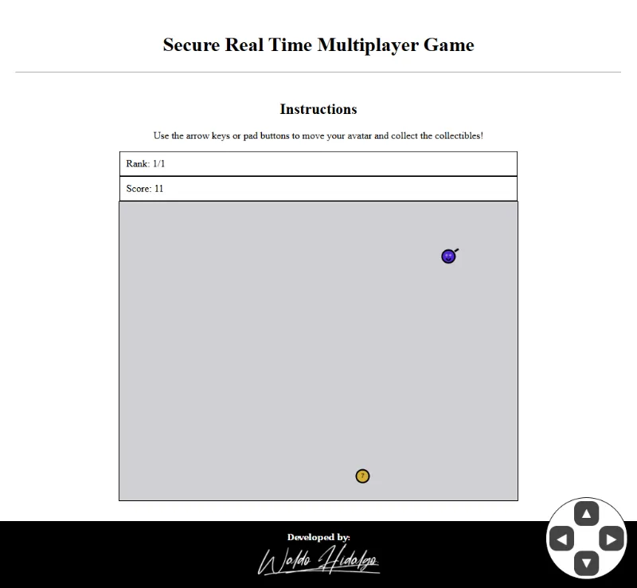
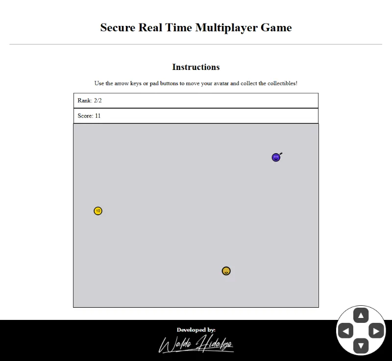
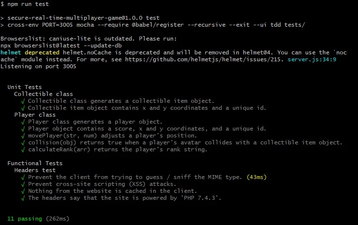
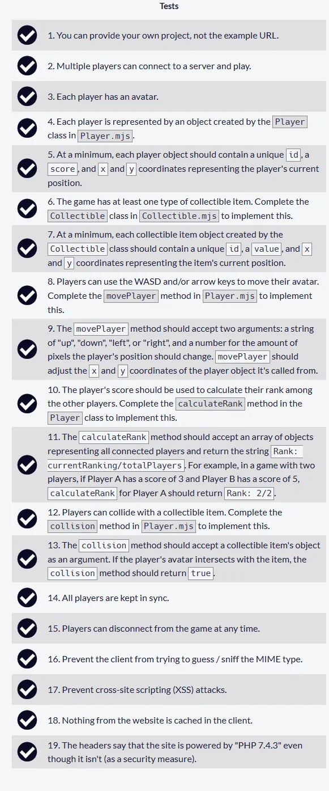
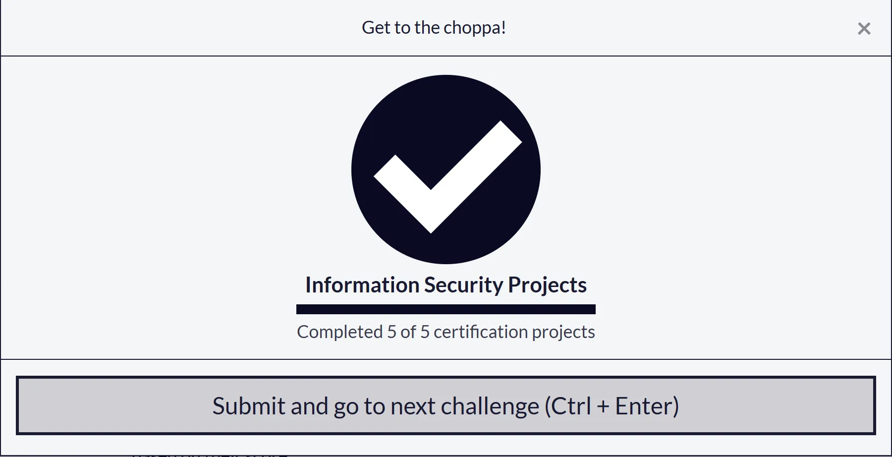

# Secure Real Time Multiplayer Game

Código solución al quinto y último proyecto requisito obligatorio para obtener la **Information Security Certification** de freecodecamp. El proyecto consiste en crear un juego de multiples jugadores en tiempo real utilizando Socket.io. El proyecto lo he desarrollado de dos formas complementarias: en local y para pruebas rapidas de sincronia he utilizado gitpod. Luego de hacer las pruebas de sincronización y eliminar condiciones de carrera problemáticas, he desplegado el proyecto a [render](https://secure-real-time-multiplayer-game-1.onrender.com/).

Además, para poder probarlo en móviles he creado un pad para utilizar touch.

## Tabla de Contenidos

- [Secure Real Time Multiplayer Game](#secure-real-time-multiplayer-game)
  - [Tabla de Contenidos](#tabla-de-contenidos)
  - [Requisitos](#requisitos)
  - [Screenshots](#screenshots)
    - [Un jugador](#un-jugador)
    - [Dos Jugadores](#dos-jugadores)
  - [Test Unitarios Aprobados](#test-unitarios-aprobados)
    - [Tests unitarios aprobados en local](#tests-unitarios-aprobados-en-local)
    - [Tests unitarios aprobados en producción](#tests-unitarios-aprobados-en-producción)
  - [Proyecto Aprobado](#proyecto-aprobado)

## Requisitos

## Screenshots

### Un jugador

### Dos Jugadores

## Test Unitarios Aprobados

### Tests unitarios aprobados en local

### Tests unitarios aprobados en producción

## Proyecto Aprobado

